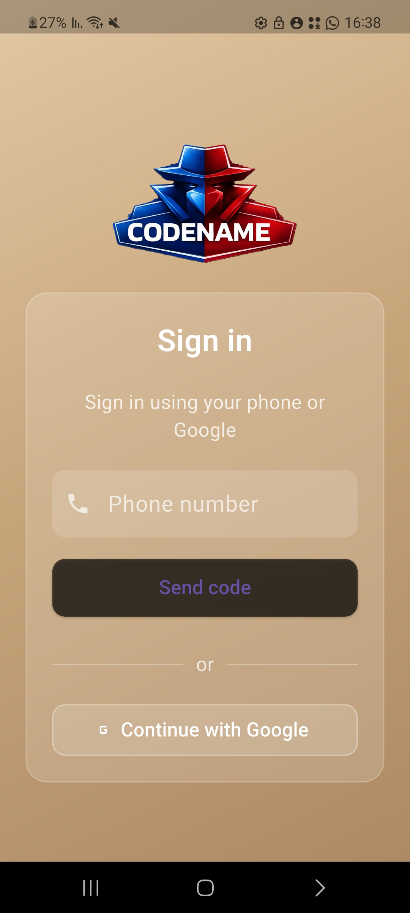
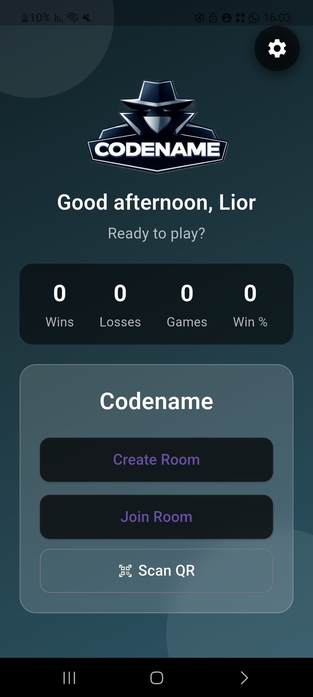
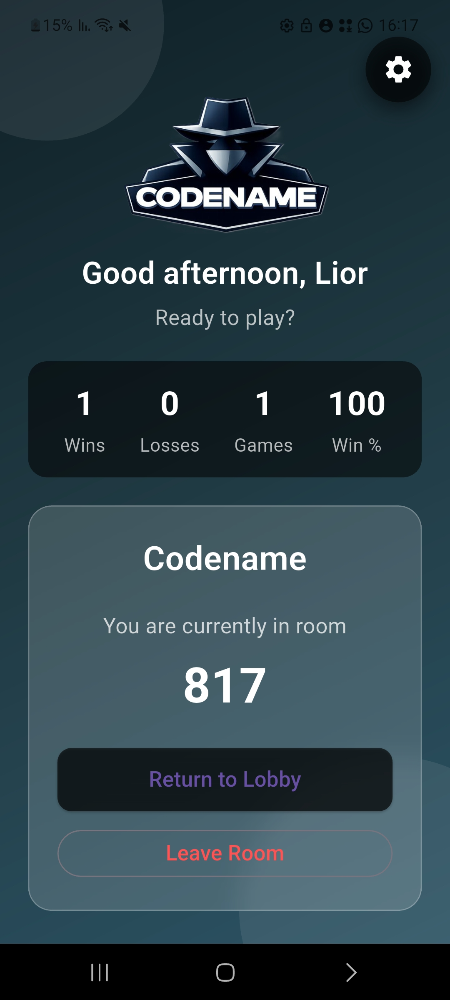
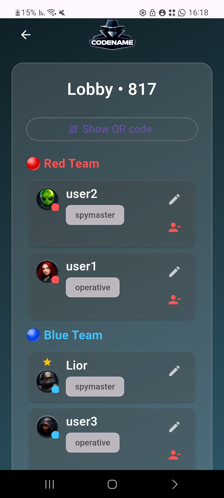
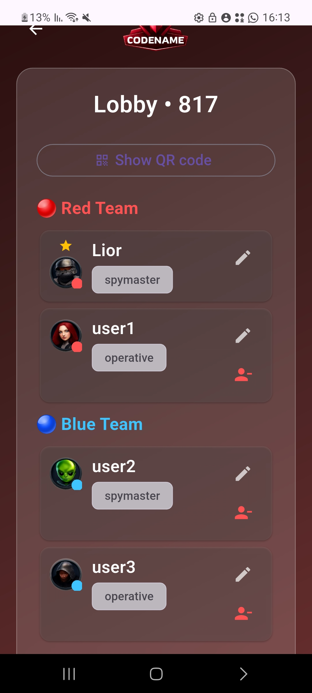
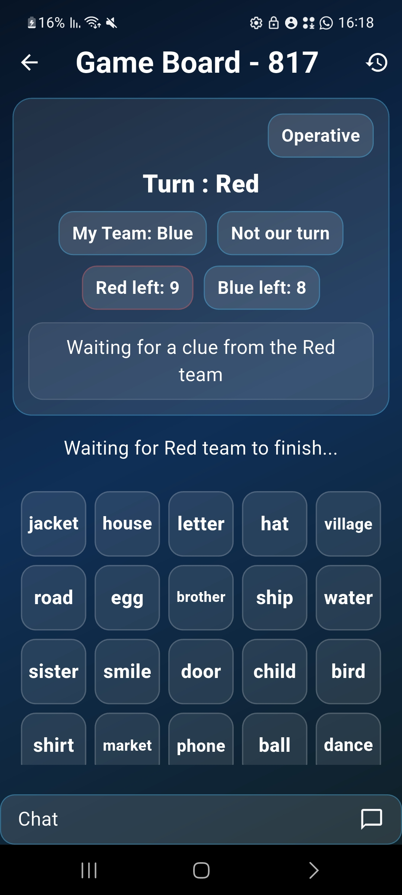
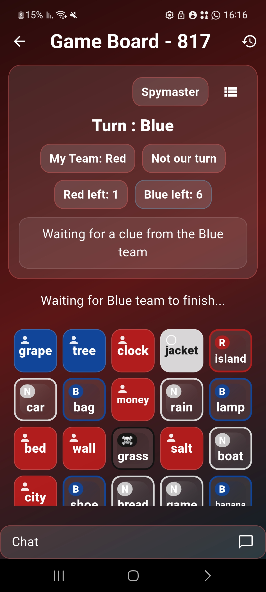
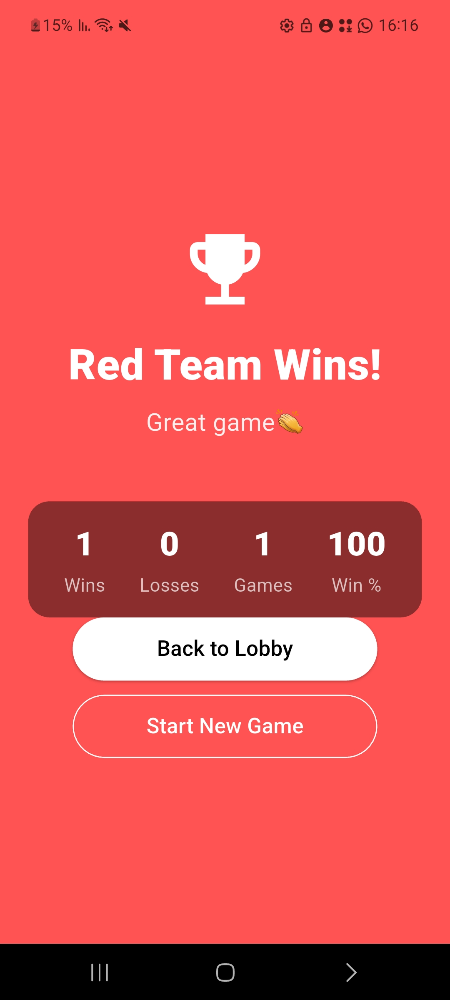

# Codenames Online Game

A real-time multiplayer mobile game inspired by Codenames, built with Flutter and Firebase.

[Download Android APK](https://drive.google.com/file/d/1Zke9A2hhzZjAi2Qw7DCYBhWAucKdV6KK/view?usp=drive_web)

The project focuses on online room-based gameplay, live synchronization, and creating a smooth multiplayer experience across devices.

## Main Features

* Real-time multiplayer gameplay
* Room creation and lobby management
* QR-based game joining
* Team and role assignment
* Live game-state synchronization
* Player reconnect handling

## Technologies

* Flutter
* Dart
* Firebase Authentication
* Cloud Firestore

## Main Project Folders

```text
lib/            Main Flutter application code
lib/screens/    App screens and UI flows
lib/services/   Game, room, authentication, and user services
lib/widgets/    Reusable UI components
lib/game/       Game-state logic
lib/theme/      App theme and styling
assets/         Images and app assets
```

## Architecture Overview

The application uses Firebase Firestore to synchronize multiplayer game state between connected players in real time.

The Flutter client manages:

* User authentication
* Room and lobby flows
* Game logic and UI
* Real-time updates between players

## Screenshots

### Authentication



### Home Screen



### Active Room



### Lobby



### Alternative Lobby Theme



### Gameplay



### Gameplay (Red Team View)



### Victory Screen




## What I Learned

Through this project, I improved my understanding of:

* Real-time application design
* State synchronization
* Mobile development with Flutter
* Firebase integration
* Building and maintaining a complete software product
